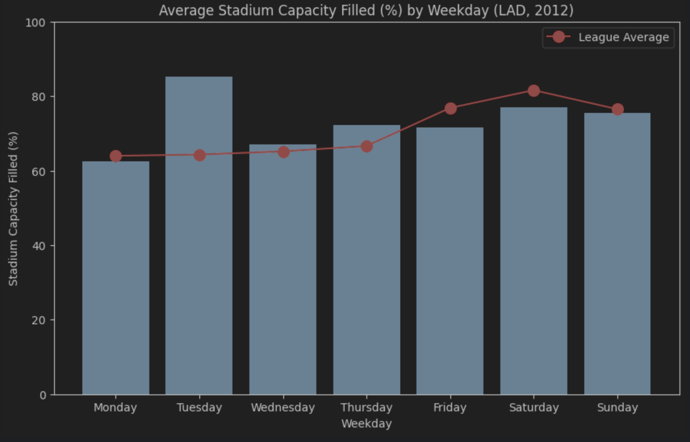
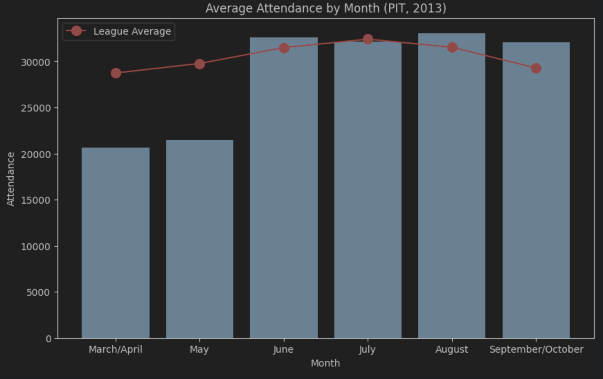
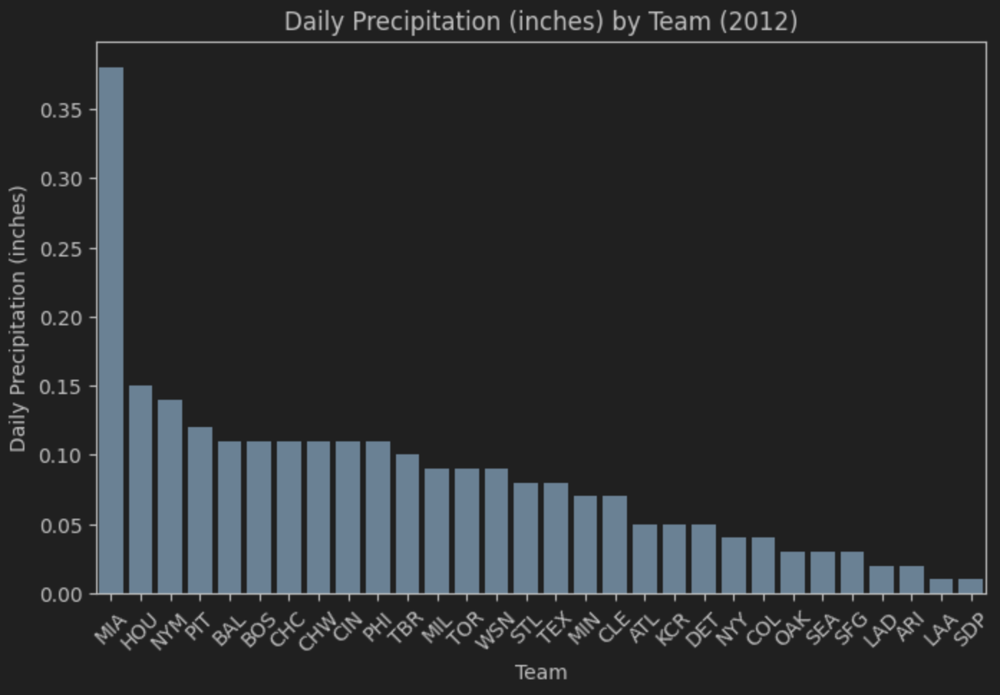
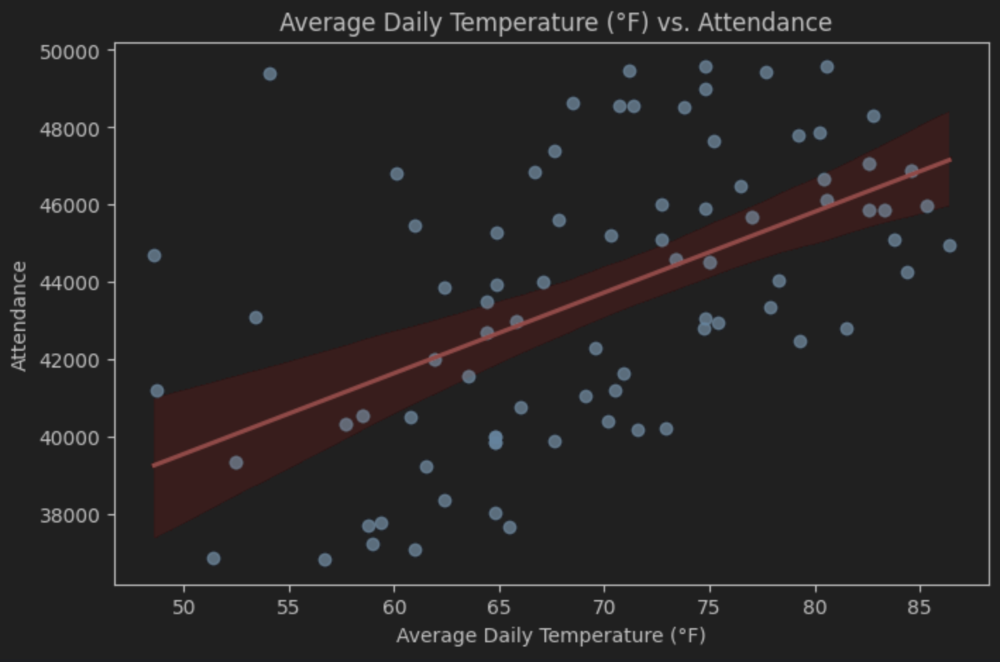
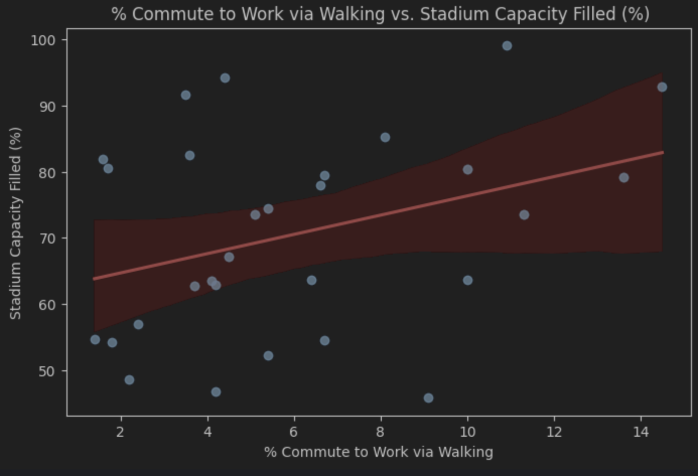
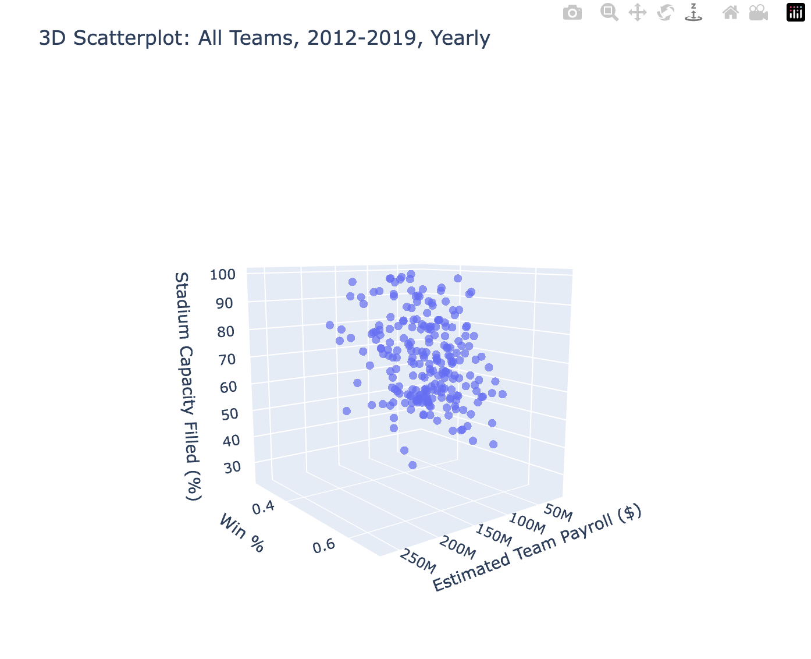

# About

This project was designed with the goal of allowing the user to plot attendance trends across the MLB from 2012 to 2019 with minimal effort from the user's end. Three data sources are considered when examining trends: game data (taken from Baseball Reference), weather data (Meteostat), and census data (US Census). There are a wide range of explanations as to why attendance might fluctuate around the league, or why a specific team might see year-to-year changes in attendance. This package aims to explain attendance trends through multiple lenses, and the user is encouraged to explore how various factors may be influencing attendance numbers behind the scenes. 

# Repository Organization

>
    .
    ├── mlbattendanceplotter
    │   ├── __init__.py                    # Initialization
    │   ├── plotting.py         
    │   └── processing.py  
    │   └── data 
    │           ├── bref_2012_2019.csv          
    │           ├── census_2012_2019.csv 
    │           ├── weather_2012_2019.csv 
    │           └── stadium_data.csv               
    ├── tests                             # Test files 
    │   ├── test_plotting.py          
    │   └── test_processing.py
    |                      
    ├── processing-notebooks              # Used for data cleaning. Not necessary for the user
    │   ├── clean_census_data.ipynb       
    │   ├── clean_gamedata.ipynb         
    │   └── clean_weather_data.ipynb                
    └── README.md
    └── setup.py
    └── images                            # Folder for images in README.md
>


# Package Requirements
This package relies on the following packages:
- pandas
- matplotlib
- seaborn
- plotly

These packages are automatically installed if the installation instructions are followed properly.


# Package Installation
1. Clone the repo
   ```sh
   git clone https://github.com/elliot-wolf/mlb-attendance-plotting.git
   cd mlb-attendance-plotting
   ```

2. Install the package and dependencies
   ```sh
   pip install .
   ``` 
3. Create a new .py or .ipynb for your own use.

4. Import necessary functions
   ```sh
   from mlbattendanceplotter.processing import *
   from mlbattendanceplotter.plotting import *
   ``` 


# Example Use

## bar_attendance_by_time()
- Type `bar_attendance_by_time?` to see valid inputs.

### Example 1
```sh
from mlbattendanceplotter.plotting import bar_attendance_by_time

bar_attendance_by_time(by="weekday", team = "LAD", year = 2012, show_league_avg=True, attendance="%")
```


- Further research suggests the Dodgers' high attendance on Tuesdays was due to their Bobblehead promotion nights during the 2012 season.

### Example 2
```sh
from mlbattendanceplotter.plotting import bar_attendance_by_time

bar_attendance_by_time(by="month", year = 2013, team = "PIT", show_league_avg=True, attendance="raw")
```


- Pirates fans were used to watching a losing team, explaining the low attendance numbers from March-May. Once fans realized they had a talented team, attendance increased.

## bar_by_team()
- Type `bar_by_team?` to see valid inputs.

### Example
```sh
from mlbattendanceplotter.plotting import bar_by_team

bar_by_team(y = 'prcp', year = 2012)
```


- Miami experienced much larger average daily precipitation in 2012 than any other team. Anaheim and San Diego experienced the least amount of daily precipitation.

## scatter_daily()
- Type `scatter_daily?` to see valid inputs.

### Example
```sh
from mlbattendanceplotter.plotting import scatter_daily

scatter_daily(x = 'tavg', y = 'attendance', team = 'NYY', year = 2012, lobf=True, show_prcp=False)
```


- As daily temperatures rise, fans attendance tends to increase in New York.

## scatter_yearly()
- Type `scatter_yearly?` to see valid inputs.

### Example
```sh
from mlbattendanceplotter.plotting import scatter_yearly

scatter_yearly(x='pct_walk', y='attendance%', year = 2013, lobf=True)
```


- The proportion of people who commute to work via walking is somewhat correlated to fan attendance. In 2013, cities with larger proportions of people who commuted to work by walking had better MLB attendance than cities with smaller proportions of people who walk to work.

## scatter_3d()
- Type `scatter_3d?` to see valid inputs.

### Example
```sh
from mlbattendanceplotter.plotting import scatter_3d

scatter_3d(x="payroll_est", y = "win_pct", z = "attendance%", time = "yearly")
```


- Over the course of 2012-2019, teams who spend more money on their roster and had higher winning percentages drew more fans to games. This plot shows the impact of team spending and performance on stadium attendance.

# Troubleshooting & Additional References

## Troubleshooting

Since Toronto is not in the US, census data was not collected and will not be plotted for the Toronto Blue Jays. In addition, some team/year combinations lack missing values due to weather station errors or missing census data. These aren't common, but just be aware that some team/year combos are missing a few variables.

### Team Abbreviations
Team abbreviations are used when plotting teams of interest. To see a list of team abbreviations, run the following:
```sh
team_abb_dict
```
Output:
```python
 'ARI': 'Arizona Diamondbacks',
 'ATL': 'Atlanta Braves',
 'BAL': 'Baltimore Orioles',
 'BOS': 'Boston Red Sox',
 'CHC': 'Chicago Cubs',
 'CHW': 'Chicago White Sox',
 'CIN': 'Cincinnati Reds',
 'CLE': 'Cleveland Guardians',
 'COL': 'Colorado Rockies',
 'DET': 'Detroit Tigers',
 'HOU': 'Houston Astros',
 'KCR': 'Kansas City Royals',
 'LAA': 'Los Angeles Angels',
 'LAD': 'Los Angeles Dodgers',
 'MIA': 'Miami Marlins',
 'MIL': 'Milwaukee Brewers',
 'MIN': 'Minnesota Twins',
 'NYM': 'New York Mets',
 'NYY': 'New York Yankees',
 'OAK': 'Oakland Athletics',
 'PHI': 'Philadelphia Phillies',
 'PIT': 'Pittsburg Pirates',
 'SDP': 'San Diego Padres',
 'SEA': 'Seattle Mariners',
 'SFG': 'San Francisco Giants',
 'STL': 'St. Louis Cardinals',
 'TBR': 'Tampa Bay Rays',
 'TEX': 'Texas Rangers',
 'TOR': 'Toronto Blue Jays',
 'WSN': 'Washington Nationals'
```

### Variables
To see a dictionary of variables to choose from, run the following:
```sh
variable_dict
```
Output:
``` python
'date': 'Date',
 'year': 'Year',
 'team': 'Team',
 'win_pct': 'Win %',
 'attendance': 'Attendance',
 'attendance%': 'Stadium Capacity Filled (%)',
 'num_home_game': 'Home Game #',
 'opp': 'Opponent',
 'opp_win_pct': 'Opponent Win %',
 'start_time': 'Start Time (Day/Night)',
 'cli': 'Championship Leverage Index',
 'tavg': 'Average Daily Temperature (°F)',
 'tmin': 'Minimum Daily Temperature (°F)',
 'tmax': 'Maximum Daily Temperature (°F)',
 'prcp': 'Daily Precipitation (inches)',
 'city': 'City/Team',
 'population': 'Population',
 'median_age': 'Median Age',
 'median_household_income': 'Median Household Income',
 'average_household_size': 'Average Household Size',
 'pct_public_transit': '% Commute to Work via Public Transit',
 'pct_car': '% Commute to Work via Car',
 'pct_walk': '% Commute to Work via Walking',
 'poverty_rate': 'Poverty Rate',
 'payroll_est': 'Estimated Team Payroll ($)'
```

## Further Analysis
Please feel free to use the data to create your own analysis / plots. To access the data outside of the plotting functions, do the following:

```sh
load_data()
```

If you want data on a yearly basis, run the following code. Team and year arguments are optional:
```sh
yearly_df = process_yearly(games, weather, census, team = None, year = None)
```

If you want data on a daily basis (does not include census data), run the following code. Team and Year arguments are optional:
```sh
daily_df = process_daily(games, weather, team = None, year = None)
```


# Credits/Citations

## Packages
- pybaseball: Helped extract data from Baseball Reference in the creation of 'bref_2012_2019.csv'
- meteostat: Extracted daily weather data from stations across all teams to create 'weather_2012_2019.csv'
- census: Assisted in collecting census data from US MLB teams to create 'census_2012_2019.csv'

## Data Sources
- [Seamheads Ballparks Database](https://www.seamheads.com/ballparks/): Allowed me to manually collect MLB stadium capacities to create 'stadium_data.csv'
- [Baseball Reference](https://www.baseball-reference.com/): In addition to attendance and game data, payroll estimates were collected and placed in 'stadium_data.csv'
- [Meteostat](https://meteostat.net/)
- [US Census](https://www.census.gov/)

